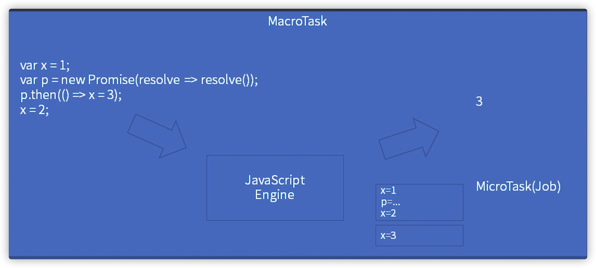
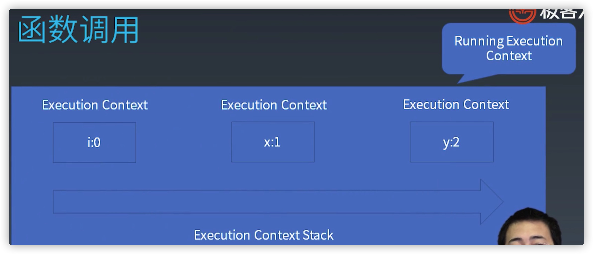
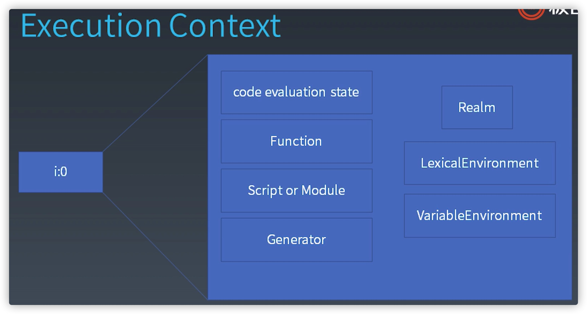

学习笔记
# 1. JS表达式 | 运算符和表达式

## Atom

Grammar(语法) | Runtiome(运行时) |
-------------- | --------------- |

## Grammar(语法)
* Tree vs Priority
## Expressions（表达式）

### Member
#### Member级别的运算符
* a.b
* a`[b]`
* foo`string`  
*//foo加反引号字符串*

在class关键字中可以使用的super
* super.b
* super[`b`]    
*//super[反引号字符串]*
* new.target
* new Foo()

#### New级别的运算符
new foo
带括号的new运算级更高
Example:
new a()()
第一个括号跟着new运算，因为跟着new运算符的()优先级更高
new new a()
同理a后面的运算符也是跟着第二个new的
#### Reference（引用类型） 补充
reference是运行中的类型，形如a.b的调用过程中，并非调用
a.b本身，而是调用a.b的引用，一个内存地址，这个引用类型并
非JS语言中的类型 ，而是运行时的类型，就是 reference

一个reference分成两个部分Object(js中的Object)和key(string or symbol)

* delete
* assign(+= -= *= /=)

js就是用引用类型在运行时来处理删除或者赋值这样的写相关操作的

### Expression-Call(函数调用)
运算优先级低于new 也低于Member运算
* foo()
* super()
* foo().b
* foo()`abc`
*foo()后跟反引号abc*

Example

new a()['b']
还是优先级 new加()最高，['b']也是Member级别
但是由于new的操作 降级成为new运算完之后的运算处理
所以可以解释为 new a() 之后调用其['b']属性

***可不可以理解为这三者优先级在一个级别上，从左往右算？***
Expression-Member-new
Expression-Member-其他
Expression-Call

### Expression-Left Handside & Right Handside(左手运算与右手运算)

#### Left Handside
a.b=c
#### Right Handside
不能放到=左边的
a+b=c 这是一个Right Handside 但是这样写不正确
Left Handside一定是Right Handside
### Expression-Update(自增自减)
自Expression-Update之后就是Right Handside
* a++
* a--
* --a
* ++a

example
++ a ++
因为这是Right Handside，所以会先和后面运算
在console中，会报错，这个报错跟优先级也没关系，不管谁先，都是错误
<font color=#FF0000>*VM522:1 Uncaught SyntaxError: Invalid left-hand side expression in postfix operation*</font> 

### Expression-Unary(单目运算符)
* delete a.b
delete 后面跟的是Reference（引用类型）
* void foo()
void 后面跟什么都返回Undefind,相当于js中的回车 换行
* typeof a
* + a
* - a
* ~ a
位运算符，整数按位取反
* ! a
针对bool的取反运算 
<font color=#FF0000>!! 强制把一个值转换成为bool值</font> 

* await a
### Expression-Exponental(乘方)
* `**`
唯一一个右结合的运算符

example
```js
3 ** 2 ** 3 //先算2的3次方，然后算3的8次方
```
### Expression-Multiplicative Additive Shift Relationship
* Multiplicative
`* / %`
* Additive
` + -`
* Shift
`<<` 
`>>`
`>>>`
* Relationship
< > <= >= instanceof
in
### Expression-Equality()
* ==
类型相等 就是相等
* ===
* !=
* !==
### Expression-Bitwise()
* & ^ | 
### Expression-Logical(逻辑运算符)
* &&
* ||
### Expression-Conditional(三目运算符)
* ?:
<font color=#FF0000>
Logical Conditional 都有短路优先原则，即前面的判断条件可以判断出结果就不会进行后面的运算
</font>

# 2. JS表达式 | 类型转换

## Type Convertion(类型转换)
 | | Number | String | Boolean | Undefind | Null | Object | Symbol |
 |-|------- | ------ | ------- | -------- | ---- | ------ | ------ |
number | - ||0 false | × | × | Boxing | × |
String ||-|"" false | × | × | Boxing | × |
Boolean |true 1<br>false 0|'true'<br>'false'|-| × | × | Boxing | × |
Undefind |NAN|'Undefind'|false| - | × |  ×| × |
Null |0|'Null'|false| × | × |  - | × |
Symbol |× |× |× | × | × |  Boxing | × |

* `-`:自己转自己
* × :不能转
number 只有

### Boxing
* ToPremitive
* to String vs valueOf
* Symbol.toPrimitive

* +会优先调用valueOf；
* o作为属性名时，会优先调用他的toString方法
* 位运算一定会先转number，转number就一定会用到valueof
* 一定会用到str的时候，一定会先调用toString
example
```js
var o{
  toString(){return "2"}
  valueOf(){return 1},
  [Symbol.toPrimitive](){return 3}
}

var x={}
x[o]=1

console.log("x"+o)
```
| 类型 | 对象 | 值 |
|---- | -----|----|
| Number | new Number(1) | 1
| String | new String('a') | 'a'
| Boolean | new Boolean(false) | false
| Symbol | new Object(Symbol('a')) | Symbol('a')
可以通过typeof区分到底是包装后的对象还是包装前的值

# 3. JS语句 | 运行时相关概念

## Statement(语句)
- 简单语句
- 组合语句
- 声明

### Completion Record(完成记录)
用于存储语句的完成结果
example
if(x==1)
return 10;
用于描述语句的执行结果：是否返回了？返回值是多少？等..

- `[[type]]`:normal,break,continue,return,or throw
- `[[value]]`:基本类型
- `[[target]]`:label

语句完成记录结果

# 4. JS语句 | 简单语句和复合语句
## 简单语句
- ExpressionStatement（完成运算 表达式 let a=1;）
- EmptyStatement(空语句 ;)
- DebuggerStatement(调试语句 debugger;)
- ThrowStatement(控制语句 抛出异常)
- ContinueStatement（控制语句 结束当前循环）
  - 跳出当前循环 
- BreakStatement（控制语句 结束所有循环）
  - 跳出循环语句
- ReturnStatement控制语句）
  - 函数中使用 返回函数结果
## 复合语句
- BlockStatement()
{
  //简单语句
}
  - `[[type]]`:normal
  - `[[value]]`:--
  - `[[target]]`:--
- IfStatement
if()
- SwitchStatement(不建议使用)
shitch(){}
- IterationStatement（循环语句）
  - while(x)x
  - do x while (x)
  - for(xx;x;x)x
  - for(xx in x)x
  - for(xx of x)x
xx表示可以定义作用域 var let 
  - for await(of) 
    - Async Generator
- WithStatement
with
- LabelledStatement
lable 简单语句
lable 复合语句
- TryStatement
try后必须跟{}不能省略
  - `[[type]]`:return 
  - `[[value]]`:--
  - `[[target]]`:label

try{x} 
catch(xx) {x} 
finally{x}

- return 语句不能打断try的结构
### 标签 循环 break continue 
break label 可以跳出多层循环节省逻辑
  - `[[type]]`:break continue 
  - `[[value]]`:--
  - `[[target]]`:label

# 5. JS语句 | 声明

- FunctionDeclaration
- GeneratorDeclaration
- AsyncFunctionDeclaration
- AsyncGeneratorDeclaration
- VariableStatement(变量声明)
有声明的作用也有实际执行计算的能力

  - function
  - function*
  - async function
  - async function*
  - var
    - var会先声明，但是没有赋值
- ClassDeclaration
- LexicalDeclaration
const let

## 预处理（pre-process）

预处理是指在一段代码执行前js引擎会对代码本身做一次预先处理

var 无论写在哪，都会被提升到当前的ife顶端定义
## 作用域
var 作用域 就在他所在的函数体
const 在他所在的{}里

# 6. JS结构化 | 宏任务和微任务

## JS执行粒度（运行时）
- 宏任务
宏任务就是 传给JS引擎的任务
JS最大粒度的范围
- 微任务（Promise）
微任务就是在JS引擎内部的任务
只有Promise才会产生微任务
- 函数调用（Execution Context）
- 语句/声明（Completion Record）
- 表达式（Reference）
- 直接量/变量/this ....

### 宏任务(MacroTask) 微任务(MicroTask(job)) 与JS引擎(JS Engine)的关系


一段代码传给JS Engine；
按照语法JS Engine把代码分为各个MicroTask(job)；
这个过程就是一个MacroTask；

#### 补充一个OC的知识链接，有时间了看看
- [JavaScriptCore 与 Objective-C](http://blog.iderzheng.com/introduction-to-ios7-javascriptcore-framework/)
- [Objective-c与javascript交互](https://blog.csdn.net/aldridge1/article/details/18079915)


### 事件循环

get code -> execute ->wait(等待锁) ->get code ...

浏览器的wait（用户输入等IO操作或者其他）
node环境的wait(网卡网络信息等)

# 7. JS结构化 | JS函数调用

在函数调用中主要是以stark（栈）的形式存储

- Execution Context(执行上下文)
- Execution Context Stack(执行上下文栈)
- Running Execution Context(执行上下文栈栈顶)

三者之间的关系为：Execution Context组成
Execution Context Stack,栈顶的Execution Context
称为Running Execution Context

## Execution Context(执行上下文)
Execution Context(执行上下文) 包括7个元素，一般不会全部生效

- code evaluation state
  - 用于async和generator函数:代码执行到何处的保存信息
- Function
  - 由Function初始化
- Script or Module
  - 只能用一个，表示在Script中的代码还是Module中的代码
- Generator
  - 只有Generator函数创建的Generator Execution Context
- Realm
  - 保存着所有的内置对象的Execution Context
- LexicalEnvironment（保存变量 let）
  - 声明代码中所需要访问的环境Execution Context
- VariableEnvironment（保存变量 var）
  - 声明代码中所需要访问的环境Execution Context
#### Execution Context(执行上下文)与Generator Execution Context(执行上下文)
Generator Execution Context比Execution Context多了一个Generator 
## LexicalEnvironment（保存变量 let)
在2018版本里几乎保存了所有的执行时候的东西
- this
- new.target
object
- super
- 变量
## VariableEnvironment（保存变量 var）
仅处理var声明的
## Environment Record()

- Environment Record
  - Declarative Environment Record
    - Function Environment Record
    - moduel Environment Record
  - Global Environment Record
  - Object Environment Record
## Function - Closure
```js
var y=2;
function foo2(){
  console.log(y);
}

export foo2;
```
执行上下文为Function处理，
Environment Record记录值，code为函数代码
会将其保存到当前函数的Environment Record属性上去
```js
Function:foo2
Environment Record: y:2
Code: console.log(2)
```

```js
var y=2;
function foo2(){
  var z=3;
  return ()=>{
    console.log(y,z);
  }
}
var foo3=foo2();
export foo3;
```
```js
Function:foo3
Environment Record: z:2 this:global
- Environment Record: y:2
Code: console.log(y,z) 
```

## Realm

- 在JS中，函数表达式和对象直接量均会创建对象。
- 使用.做隐式转换也会创建对象。
- 这些对象也有原型，如果我们没有Realm，就不知道他们的原型是什么。