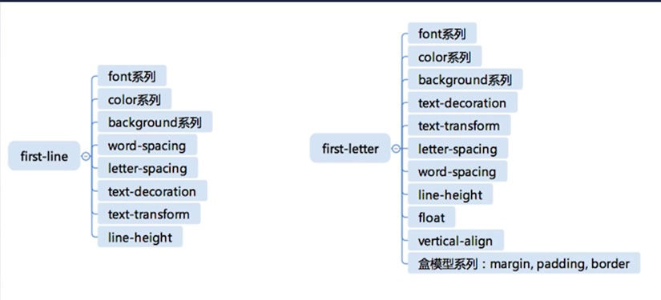

学习笔记

# 1. CSS总论 | CSS语法的研究

 
## css2.1 css总体结构
- @charset
- @import
- rules
  - @media
  - @page
  - rule

# 2. CSS总论 | CSS @规则的研究
- @charset : https://www.w3.org/TR/css-syntax-3/
  - 声明CSS的字符集
- @import :https://www.w3.org/TR/css-cascade-4/
  - css cascade 级联规则标准 级联样式表(cascading style sheet)
- `@media` :https://www.w3.org/TR/css3-conditional/
  - 重要： css3-conditional（css3 有条件发生）media query 是一个预制好的函数（查询媒体的一个规范）
- @page : https://www.w3.org/TR/css-page-3/
  - css3 分页媒体标准（打印机）
- @counter-style :https://www.w3.org/TR/css-counter-styles-3 
  - css前的小黑点
- `@keyframes` :https://www.w3.org/TR/css-animations-1/
  - 重要：css动画标准
- `@fontface `:https://www.w3.org/TR/css-fonts-3/
  - 重要 ：定义一切字体（不止webfont 衍生体 icon font）
- @supports :https://www.w3.org/TR/css3-conditional/
  - 不推荐
- @namespace :https://www.w3.org/TR/css-namespaces-3/
  - css命名空间

# 3. CSS总论 | CSS规则的结构

## CSS规则
```css
div {
  background-color: blue;
}
```
- 选择器 Selector
  - https://www.w3.org/TR/selectors-3/ 
  - https://www.w3.org/TR/selectors-4/
- 声明 Declaration
  - Key
    - Properties
    - Variables: https://www.w3.org/TR/css-variables/
  - Value
    - https://www.w3.org/TR/css-values-4/

# 4. CSS总论 | 收集标准

## 爬取css网站信息
- https://www.w3.org/TR/?tag=css
```js
  Array.prototype.slice.call(document.querySelector('#container').children).filter(e => e.getAttribute('data-tag').match(/css/)).map(e => ({
    name: e.children[1].innerText,
    url: e.children[1].children[0].href
  }))
```
也不难 学学
```js
 //1
 Array.prototype.slice.call(`$2`)
 //2
 document.querySelector('#container').children
 //3
 `$1`.filter(`$4`)
 //4
 e => e.getAttribute('data-tag').match(/css/)).map(`$5`)
 //5
 e => ({
    name: e.children[1].innerText,
    url: e.children[1].children[0].href})
```
### 要点
```js
// 同域 访问iframe.contentDocument
iframe.contentDocument.querySelectorAll(".propdef")
```
# 5. CSS总论 | CSS总论总结

- CSS语法
- at-rule
- selector
- variables
- value
- 实验

# 6. CSS选择器 | 选择器语法

## 选择器语法
### 简单选择器
- `*`
- div svg|a
- .class
  - 可以通过空白符（空格）指定多个class
- #id
  - `#` 必须严格匹配
- [attr=value]
  - name=value

| 属性名 | 描述  | 举例 |
|------ | ----- | --- |
|[attr] | 匹配指定的属性名的所有元素。 | [align]{color: red;}
[attr=val] | 匹配属性等于指定的值所有元素。 | [align=center]{color: red;}
[attr^=val] | 匹配属性以指定的属性值开头的所有元素 | [color^="#f"]{color :mediumblue;}
[attr$ =val] | 匹配属性以指定的属性值结尾的所有元素 | [color$="aa"]{color :mediumblue;}
[attr*=val] | 匹配属性中包含指定的属性值所有元素 | [color*="aa"]{color :mediumblue; }
- :hover
  - 带有函数执行
  - 有交互动作
- ::before

### 选择器语法

- 复合选择器
  - <简单选择器><简单选择器><简单选择器>
    - p.one   选择的是： 类名为 .one  的 段落标签。 
  - *或者div必须写在前面
- 复杂选择器
  - <复合选择器><sp><复合选择器>
    - div p (父子可以没有直接相关)
  - <复合选择器> `>` <复合选择器>
    - div > p （父子需要直接相关）
  - <复合选择器> `~` <复合选择器>
    - div ~ p （父子需要直接相关 子为邻接关系）
  - <复合选择器> `+` <复合选择器>
  - <复合选择器> `||` <复合选择器>
    - #table1 || X （表格 选中某一个列）
    
**逗号表示选择器或**

# 7. CSS选择器 | 选择器的优先级

- CSS标准定义 选择器的优先级
  - 选择器优先级就是对一个选择器里面包含的所有简单选择器进行计数

```css
#id div.a#id {
/* ... */
}
```
数值 [0,2,1,1]

公式 `S=0* N^3^ + 2* N^2^ + 1* N^1^ +1`
`N`为`1 000 000` `S`为`2 000 001 000 001`
我理解这个就表示当前数量级下出现的次数的数组，再按照基数`N`来进行计算,
值为`S`
```js
     arr[0]*n**3+arr[1]*n**2+arr[2]*n**1+arr[3];
```

# 8. CSS选择器 | 伪类

- `链接/行为`
  - :any-link
    - 所有超链接 相当于 :link + :visited
  - :link:visited
    - 设置 visited之后不能更改除了文字颜色以外的其他属性了，因为其他属性改动之后就可以获取到这个元素，进而可以获取是否访问过了
  - :hover
  - :active
  - :focus
  - :taget
    - 链接到当前目标，给a标签使用的（当前的HASH如果指向了当前的a标签所表示的链接，就会激活这个伪类）
- 树结构
  - :empty
    - 是否有子元素
  - :nth-child()
    - 比较复杂 
    - :nth-child(n) 选择器匹配属于其父元素的第 N 个子元素，不论元素的类型。n 可以是数字、关键词或公式。
      - :nth-child(5)  选取第五个标签
      - :nth-child(n+3)  选取大于等于3的标签
      - :nth-child(-n+3)  选取小于等于3的标签
    - :nth-child (an + b)  描述：表示周期的长度，n 是计数器（从 0 开始），b 是偏移值。
      - :nth-child(2n)  选取偶数标签，等同于:nth-child(even)
      - :nth-child(2n-1)  选取奇数标签，等同于:nth-child(odd)
      - :nth-child(3n+1) 每隔两个元素选取一个
  - :nth-last-child()
    - :nth-last-child(3)  选取倒数第三个
  - :first-child :last-child :only-child 
    - :last-child  选取倒数第一个 
    - 这三个会破坏CSS回溯性原则
- 逻辑型
  - :not伪类
    - 不能写逻辑 复合型选择器 
  - :where :has
    - css4 逻辑选择

总结：不能出现特别复杂的选择器，如果这样，有可能是HTML写的有问题

# 9. CSS选择器 | 伪元素

伪元素就是通过选择器向界面添加了一个不存在的元素
## 目前可用的伪元素
- ::before
  - 如果元素有此伪元素 declaration中可以加入content属性 
- ::after
  - 如果元素有此伪元素 declaration中可以加入content属性
- ::first-line
  - 特点 把特定的逻辑意义的元素括起来 选中第一行
- ::first-letter
  - 特点 把特定的逻辑意义的元素括起来 选中第一个字母

不污染dom树，来给页面添加一些修饰性的内容
```html
<div>
<::before/>
<::first-letter>c</::first-letter>ontent content content 
content content content 
<::after/>
</div>
```



** 为什么 first-letter 可以设置 float 之类的，而 first-line 不行呢？**

个人理解float属性是相对父级的，
first-line与父级同宽

编写一个 match 函数。它接收两个参数，
第一个参数是一个选择器字符串性质，第二个是一个 HTML 元素。
这个元素你可以认为它一定会在一棵 DOM 树里面。
通过选择器和 DOM 元素来判断，当前的元素是否能够匹配到我们的选择器。
（不能使用任何内置的浏览器的函数，仅通过 DOM 的 parent 和 
children 这些 API，来判断一个元素是否能够跟一个选择器相匹配。）
以下是一个调用的例子。
