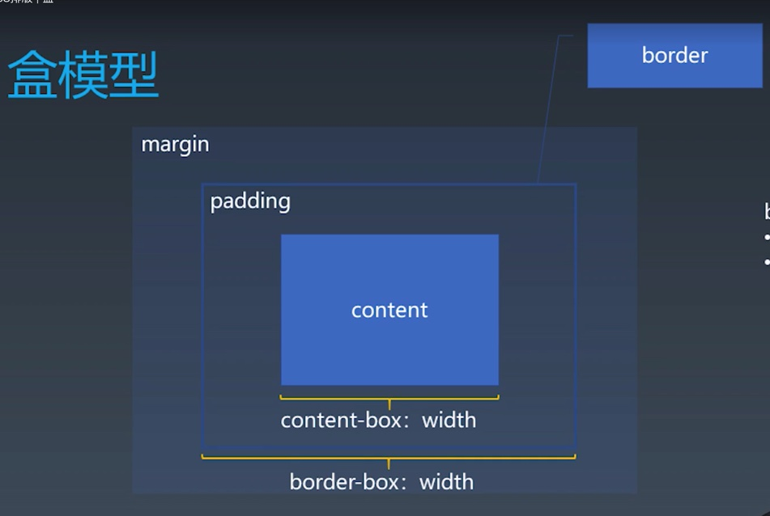
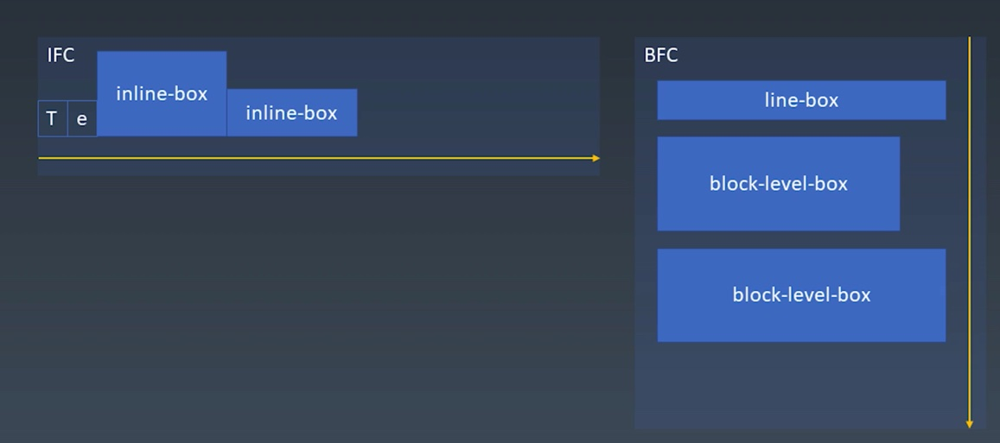
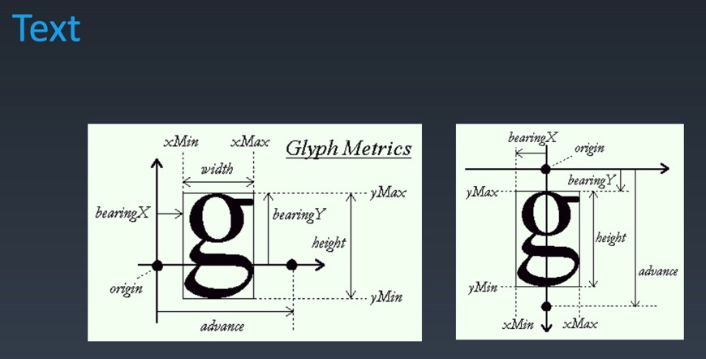
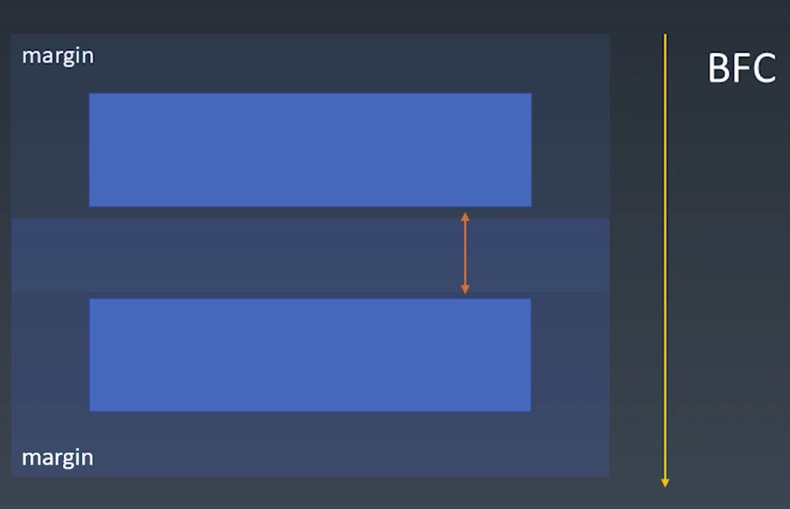

# 1. CSS排版 | 盒
| 源代码 | 语义 | 表现 |
| ---- | ----- | ---- |
| 标签 tag | 元素 element | 盒 box

- HTML代码可以书写开始`标签`,结束`标签`,和自封闭`标签`。
- 一对起止的`标签`，表示一个`元素`。
- DOM树中储存的是`元素`和其他类型的节点（Node）。
  - 节点说的是，存储在DOM上的也不一定是元素，比如文本节点，等。
- CSS选择器选中的是`元素`。
  - 也可以是伪元素。
- CSS选择器选中的`元素`，在排版时可能产生多个`盒`.
  - 可能是一对多的选择
- 排版和渲染的基本单位是`盒`。

## 盒模型



- padding主要影响盒内排版
- margin主要影响盒本身排版
- box-size:
   - content-box
     - 设置的width只包含content的内容，这个时候盒子占用的空间为content-box+padding+border+margin
  - border-box
    - 包含padding+border+content-box

# 2. CSS排版 | 正常流

## 三代排版技术

**`layout 排版` 可见的东西放到指定的位置**

**`css`就是将一切的盒 文字安排到指定的位置**

- 基于正常流排版
  - 能力最差
  - 机制复杂
- 基于flex技术排版（主流 也最简单）
  - 比前一代后一代都简单
- 基于grid技术排版
- 3.5 基于CSS Houdini 可以用JS干预的排版

### 基于正常流排版
- 收集`盒`进行
  - 盒与文字
- 计算盒在行中的排布
  - 盒与文字
- 计算行的排布



# 3. CSS排版 | 正常流的行级排布

- Baseline(基线)
  - 文字在书写时的基础参照线
- Text
  - C++底层库 freeType 参照原点（origin）对一个字母进行抽象定义


- 行模型
  - line-top
    - 如果行高大于文字的高度就表示行的最高的线
  - text-top
    - 字体混排时，一行中最大的字决定
  - base-line
  - text-bottom
    - 字体混排时，一行中最大的字决定
  - line-bottom
    - 如果行高大于文字的高度就表示行的最低的线

## line.html中表示的
- 行内盒 inline-block 基线是根据里边文字最后一行对齐的
- 添加vertical-align属性可以规定inline-block的对齐方式
- vertical-align
  - top
    - line-top
  - bottom
    - line-bottom
  - text-top
  - text-bottom

# 4. CSS排版 | 正常流的块级排布

## float与clear (浮动元素)
- float与clear(浮动元素)严格意义上说，已经脱离正常流，但是是依附于正常流去定义的
### float.html
- float 属性会让元素浮动
  - left right
- clear 属性会让元素在浮动的方向（左右）上找出一个在交叉轴上（上下）的位置
  - left right both
### 使用clear实现float元素的换行效果（float2.html）
- 在使用float作为布局的主要方式的时候，添加clear属性会实现类似于正常流中换行的效果，但是使用正常流中的`<br/>`是不能实现这个效果的，在float中
### 谨慎使用float（float3.html）
- 使用float是发生了一定的重排行为的（因为使用float挡住了首次排版的文字），所以要谨慎使用
### Margin Collapse(边距折叠)( float4.html)
- 指的当且仅当在一个BFC里，两个拥有margin属性的相邻的元素之间的margin会只保留最大的，而不是相加


# 5. CSS排版 | BFC合并

## Block
- Block Container:里面有BFC的block
  - 能容纳正常流的盒，里面就有BFC的block
- Block-level Box:外边有BFC的block
- Block Box=Block Container+Block-level Box
  - 里外都有BFC的block
### Block Container
- 所有能够容纳里边不是特殊的display的模式的，默认就是正常流
- Block Container
  - block
  - inline-block
  - table-cell
  - flex item
    - flex 不是,但是里边的子元素可以放
  - grid cell
  - table-caption
###  Block-level Box
- 大多数的display的值都是对应的，一个是Block level ，一个是 Inline level

| Block level | Inline level |
| ----------- | ------------ |
| display:block | display: inline-block |
| display: flex | display: inline-flex |
| display: table | display: inline-table |
| display: grid | display: inline-grid |
| ...... | ...... |
display: run-in (没见用过)
### 如何产生一个BFC（css2.1标准）
- floats（浮动）
- absolutely positioned elements（绝对定位）
- block containers (such as inline-blocks, table-cells, and table-captions) that are not block boxes,
  - flex items
  - grid cell
  - ......
- and block boxes with 'overflow' other than 'visible'

### 反这来说，什么情况下不会产生BFC
- 默认情况都会发生BFC，但是有种请款会发生BFC合并，那么就只有这种情况下不会有BFC
### 何时会发生BFC合并
- block box && overflow:visible
  - 里外都是BFC，并且overflow:visible
###### overflow:visible 超出不会被修剪
### BFC合并的影响
- BFC合并与float
  - 设置overflow:visible的元素，会与float元素合并(bfc1.html）
  - 设置overflow不为visible的元素，会产生新的BFC结构(bfc1.html）
- BFC合并与边距折叠
  - 设置overflow:visible的元素，相邻的两个元素会发生边距折叠(bfc2.html)
  - 设置overflow不为visible的元素，相邻的两个元素会产生新的BFC结构(bfc2.html)

# 6. CSS排版 | Flex排版

- 收集盒进行
  - 分行
    - 根据主轴尺寸，把元素分进行
    - 若设置了no-wrap,则强行分配到第一行
- 计算盒在主轴方向的排布
  - 计算主轴方向
    - 找出所有flex元素
    - 把主轴方向的剩余尺寸按比例分配给这些元素
    - 若剩余空间为负数，所有flex元素为0，等比压缩剩余元素
- 计算盒在交叉轴方向的排布
  - 计算交叉轴方向
    - 根据每一行中最大元素尺寸计算行高
    - 根据行高flex-align和item-align，确定元素具体位置

# 7. CSS动画与绘制 | 动画

## Animation
- @keyframes定义
  - 使用keyframes和@rule定义关键帧
  - from 相当于0%;to 相当于100%
```css
@keyframes mykf
{
from {background: red;} 
to {background: yellow;} }
```
- animation:使用
```css
div{
animation:mykf 5s infinite; }
```
### Animation 属性
- animation-name 时间曲线
- animation-duration 动画的时长
- animation-timing-function 动画的时间曲线
- animation-delay 动画开始前的延时
- animation-iteration-count 动画的播放次数
- animation-direction 动画的方向

```css
@keyframes mykf {
0% { top: 0; transition:top ease}
50% { top: 30px;transition:top ease-in } 
75% { top: 10px;transition:top ease-out } 
100% { top: 0; transition:top linear}
}
```
## Transition
### Transition属性
- transition-property 要变换的属性
- transition-duration 变换的时长
- transition-timing-function 时间曲线
- transition-delay 延迟

### cubic-bezier
- 一阶贝塞尔曲线(线段)：
  - 意义：由 P0 至 P1 的连续点， 描述的一条线段
- 二阶贝塞尔曲线(抛物线)：
  - 原理：由 P0 至 P1 的连续点 Q0，描述一条线段。
  - 由 P1 至 P2 的连续点 Q1，描述一条线段。
  - 由 Q0 至 Q1 的连续点 B(t)，描述一条二次贝塞尔曲线。
  - 经验：P1-P0为曲线在P0处的切线。
- 三次贝尔曲线以及更高次原理相同
  - 原理：由 P0 至 P1 的连续点 Q0，描述一条线段。
  - 由 P1 至 P2 的连续点 Q1，描述一条线段。
  - 由 P2 至 P3 的连续点 Q2，描述一条线段。
  - 由 Q0 至 Q1 、Q1 至 Q2 的连续点 B(t)，描述一条三次贝塞尔曲线。
  - 经验：P1-P0为曲线在P0处的切线。

那也就是说 如果切点P足够多 就可以绘制半个圆


https://www.cnblogs.com/hnfxs/p/3148483.html

# 8. CSS动画与绘制 | 颜色
## 颜色
## CMYK与RGB
- CMYK
  - Cyan青色,Magenta品红,Yellow黄,BlacK黑(混起来就是黑色，但是黑色便宜，独立出来)
- RGB
## HSL与HSV
- CSS语义化颜色
- W3C主要支持HSL，但是可以转换两者
- hsv.html的例子主要是说方便管理，改变颜色只需要设置色相值

# 9. CSS动画与绘制 | 绘制

## 绘制的分类
- 几何图形
  - border
  - box-shadow
  - border-radius
- 文字
  - font
  - text-decoration
- 位图
  - background-image
## 应用技巧
- data uri, + svg
- `data:image/svg+xml,<svg width="100%" height="100%" version="1.1" xmlns="http://www.w3.org/2000/svg"><ellipse cx="300" cy="150" rx="200" ry="80" style="fill:rgb(200,100,50); stroke:rgb(0,0,100);stroke-width:2"/> </svg>`
