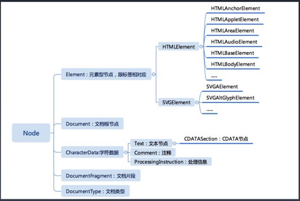

# 1. 重学HTML | HTML的定义：XML与SGML
- HTML的定义：继承与XML与SGML的基础
## DTD与XML namespace

- http://www.w3.org/TR/xhtml1/DTD/xhtml1-strict.dtd 
  - 使用css属性white-space代替`&nbsp;`,因为使用`&nbsp;`改变了原有的HTML语义结构
  - white-space 属性会影响到浏览器对文档中空格、回车和制表符的处理效果。
  - `&Lambda`就是`^`
- http://www.w3.org/1999/xhtml

## DTD 常用转义符
| 字符	| 十进制 | 转义字符 |
| ---- | ----- | ------ |
| " |	`&#34;` |	`&quot;` |
| &	| `&#38;`	| `&amp;` |
| <	| `&#60;`	| `&lt; `|
| >	| `&#62;`	| `&gt; `|
| 不断开空格(non-breaking space) | `&#160;` |	`&nbsp;` |
# 2. 重学HTML | HTML标签语义

- `<main></mian>` 放的主要部分 表示一个
- `<hgroup></hgroup>` 标题组
- `<abbr></abbr>` 表示缩写、简写 有title属性
- `<strong></strong>` 表示重点 文章的重点
- `<em></em>` 表示强调 语气上
- `<figure></figure>` 用作文档中插图的图像
- `<figcaption></figcaption>` 元素为 figure 添加标题
- `<nav></nav>` nav 标签定义导航链接的部分。
- `<dfn></dfn>` dfn表示定义当前的词
- `<samp></samp>` 表示例子
- `<pre></pre>` 表示引入代码
- `<code></code>` 代码

# 3. 重学HTML | HTML语法

## 合法元素
- Element: `<tagname>...</tagname> `
- Text: text
- Comment: `<!-- comments -->`
- DocumentType: `<!Doctype html>`
- ProcessingInstruction: `<?a 1?>`
- CDATA:`<![CDATA[ ]]>`

## 字符引用
- `&#161;`
  - 引用ASK编码&+数字
- `&amp; `
  - `&`符号
- `&lt;`
  - `<`
- `&quot;`
 - 引号`"`

# 4. 浏览器API | DOM API

## dom节点家族


## 导航类操作
- 选择节点有两种方式，按照node节点选择，按照元素节点选择
- 按照节点选择容易选到空节点，但是是按照元素不会

- 对于节点的操作
  - parentNode 
  - childNodes 
  - firstChild
  - lastChild
  - nextSibling
  - previousSibling
- 对于元素的操作
  - parentElement
  - children
  - firstElementChild
  - lastElementChild
  - nextElementSibling
  - previousElementSibling

## 修改操作

- appendChild
  - 插入到最后节点
- insetBefore
  - 插入到具体节点前
- removeChild
  - 无法移除自身，只能在父级上去操作
- replaceChild

## 高级操作
- compareDocumentPosition 是一个用于比较两个节点中关系的函数。
- contains 检查一个节点是否包含另一个节点的函数
- isEqualNode 检查两个节点是否完全相同。
- isSameNode 检查两个节点是否是同一个节点，实际上在JavaScript 中可以用“===”。
- cloneNode 复制一个节点，如果传入参数 true，则会连同子元素 做深拷贝。

# 5. 浏览器API | 事件API
- 冒泡 一层一层的往外传
  - 浏览器默认参数为false 这样复合人的直觉 
- 捕获 有外向内去触发
  - 肯定会发生的事件，从硬件层面去点击上来讲，你肯定要去先找出这个点，那就是捕获过程
## addeventListener
- 默认三个参数，最后一个参数的passive默认为true
- 冒泡和捕获跟监听是没有关系的，加不加addeventListener都是会发生的
- 默认为冒泡 是浏览器处理事件的一种机制 加不加都会触发
## event.html

- 默认冒泡，b先触发,默认false
```js
  var a= document.getElementById('a');
  var b= document.getElementById('b');
  a.addEventListener('click',function(){console.log(a)})
  b.addEventListener('click',function(){console.log(b)})
```
- 添加捕获，true,a1先触发,b,b1以次触发，然后是a的冒泡
```js
  a.addEventListener('click',function(){console.log(a1)},true)
  b.addEventListener('click',function(){console.log(b1)},true)
```
- 再次添加其他事件，都会在添加之后执行那就是a1先触发,b,b1,b3以次触发，然后是a的冒泡
```js
  b.addEventListener('click',function(){console.log(b3)})
```
# 6. 浏览器API | Range API

## 问题 把一个元素所有的子元素逆序（DOM操作），把12345变为54321
  - node节点操作，需要4次操作
  - 两个考点
    - reverse0.html
      - DOM的collection，是动态的，取出来之后的nodelist是会变化的
    - reverse1.html
    - 元素的子元素在insert的时候，如果这个节点已经在dom树上，肯定会先remove下来，在append上去
  - 使用range Api 进行高效操作dom

## Range api 定义
- var range = new Range()
- range.setStart(element, 9)
- range.setEnd(element, 4)
  - 定义起始点终点
- var range = document.getSelection().getRangeAt(0);

## Range api 操作

- range.setStartBefore 
- range.setEndBefore 
- range.setStartAfter
- range.setEndAfter
- range.selectNode
- range.selectNodeContents
  - 选中一个节点下面的内容

## Range api 操作2
- var fragment = range.extractContents()
  - 相当于用range吧元素从dom树上摘下来
  - range.extractContents的是一个fragment对象，在操作时，会把他所有的子元素作用到DOM上，而它本是不会
- range.insertNode(document.createTextNode("aaaa"))
  - 将元素节点添加到指定range上

## range.html
```js
//指定range的起始点与终点
 let range=new Range();
//  第0个子元素的第3个位置
  range.setStart(document.getElementById('a').childNodes[0],3);
  range.setEnd(document.getElementById('a').childNodes[2],3);
```
- range.extractContents() 移除
```js
range.extractContents()
```
- 移除span标签内容
```js
//指定range的起始点为第1个子元素的第0位开始， 然后移除
range.setStart(document.getElementById('a').childNodes[1],0);
```
- 移除第1个元素的半个 标签 只需要选到1的子元素的具体的那个店
```js
range.setStart(document.getElementById('a').childNodes[1].childNodes[0],3);
```

# 7. 浏览器API | CSSOM

## document.styleSheets
- document.styleSheets
  - 访问CSSDOM属性，是从document.styleSheets上获取
  - stylesheet.html

### Rules
document.styleSheets的子类
- document.styleSheets[0].cssRules
  - 访问cssRules
- document.styleSheets[0].insertRule("p { color:pink; }", 0)
  - 添加CSS规则在指定的位置（0）
- document.styleSheets[0].removeRule(2)
  - 删除CSS规则在指定的位置（2）

### Rule
- CSSStyleRule
  - 对应CSS rule
- CSSCharsetRule
  - 其他对应其他的at-rule
- CSSImportRule
- CSSMediaRule
- CSSFontFaceRule
- CSSPageRule
- CSSNamespaceRule 
- CSSKeyframesRule
- CSSKeyframeRule
- CSSSupportsRule
- ......

### CssStyleRule

- selectorText String 
  - 选择器部分（selectorText）比如 p
- style K-V结构
  - 样式部分（style）花括号部分内容{color:red;}

### 使用styleSheets修改样式的有点

- 可以批量修改
  - styleSheet.html
```js
document.styleSheets[0].cssRules[0].style.color='blue';
```

### getComputedStyle
- window.getComputedStyle(elt, pseudoElt); 
  - 获取元素最终通过计算和渲染之后的CSS属性
- elt 想要获取的元素
- pseudoElt 可选，伪元素
  - 获取伪元素最终通过计算和渲染之后的CSS属性
```js
//获取a元素最终的计算属性
getComputedStyle(document.querySelector('a'))
//获取a元素的伪元素最终的计算属性
getComputedStyle(document.querySelector('a'),"::before")
getComputedStyle(document.querySelector("a"),'::before').color //"rgb(0, 0, 255)"

```
# 8. 浏览器API | CSSOM View
CSSOM View 浏览器API

## window

- window.innerHeight, window.innerWidth 
  - html所占据的内容
- window.outerWidth, window.outerHeight 
  - 浏览器窗口总共占据的空间
- window.devicePixelRatio
  - 屏幕上的机器物理像素（重要 理论上1px=1px物理像素，在不同的硬件设备上会有不同的比值）
- window.screen
  - window.screen.width
  - window.screen.height
    - 实际屏幕的宽和高
  - window.screen.availWidth 
  - window.screen.availHeight
    - 实际屏幕可以使用的宽和高

## Window API
打开一个新窗口会使用到的api
- window.open("about:blank", "_blank" ,"width=100,height=100,left=100,right=100" )
  - 打开一个窗口（一般只有前两个参数，第三个参数指定大小）
- moveTo(x, y)
- moveBy(x, y)
- resizeTo(x, y)
- resizeBy(x, y)
  - 如果这个窗口是你创建的，那么就可以调用下面4个方法，来改变窗口

## scroll
只有当有滚动条的时候才有scroll
- scrollTop
- scrollLeft
- scrollWidth
- scrollHeight
- scroll(x, y)
- scrollBy(x, y)
- scrollIntoView()
## window 
- scrollX 
- scrollY
- scroll(x, y)
- scrollBy(x, y)

## layout
dom上的元素都可以使用两个方法,返回一个包含元素的类数组
- getClientRects()
  - 取出元素上所有生成的盒
- getBoundingClientRect()
  - 取出元素上所有生成的盒(以一个表示)

# 9. 浏览器API | 其它API

## 标准化组织

- khronos
  - WebGL
- ECMA
  - ECMAScript
- WHATWG
  - HTML
- W3C
  - webaudio
  - CG/WG
