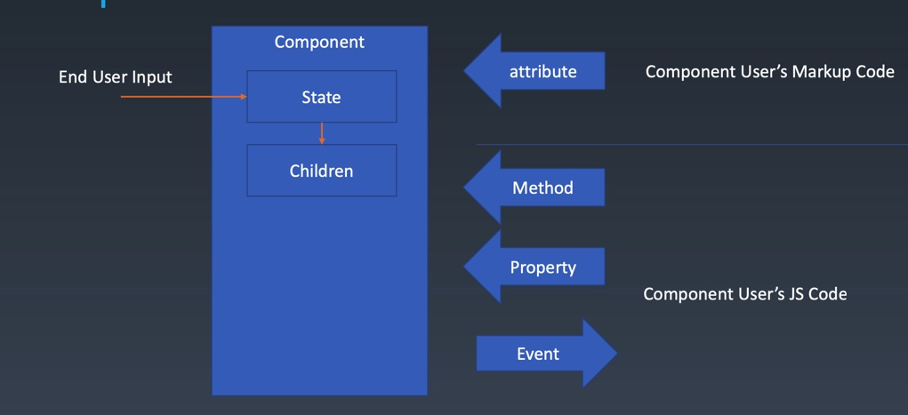

# 1. 组件的基本知识 | 组件的基本概念和基本组成部分

## 对象与组件
| 对象 | 组件 | 描述 |
| --- | ---- |-------|
| Properties | Properties|属性 |
| Methods | Methods | 方法  |
| Inherit | Inherit | 继承关系 |
| | Attribute | 特性|
| | Config & State | 组件配置 与 组件的状态 |
| | Event | 组件往外传东西 |
| | Lifecycle | 组件有生命周期 |
| | Children | 形成树形结构必备 |
## Component

- `End User Input` 改变 `Component State`
- `Component User’s ` 通过 `Markup Code (标记语言 xml html ...)` 改变 `attribute` 使用组件
- `Component User’s ` 通过 `JS Code` 改变 ` Method` `Property` 使用组件
- `Component Dever’s ` 通过 `JS Code` 设计 ` Method` `Property` 向 `Component User’s ` 设计组件
## Attribute 与 Property
- `Attribute` 强调描述性
- `Property` 强调从属关系

### HTML中的 Attribute 与 Property
- Attribute:
```html
<my-component attribute=“v” />
<script> 
myComponent.getAttribute(“a”);
myComponent.setAttribute(“a”,“value”);
</script>
```
- Property
```js
myComponent.a = “value”;
```
#### HTML中的 Attribute 与 Property 区别点
- html中class关键字不能使用，当前版本JS可以取到clss，但是html中还是不能使用
```html
<div class="cls1 cls2"></div>
<script>
var div = document.getElementByTagName(‘div’); 
div.className // cls1 cls2
div.class //当前版本 也是可以取到的
</script>
```
- html中 `Attribute` 可以写成`string`,但是`Property`转化为了KV结构的对象
```html
<div class="cls1 cls2" style="color:blue" ></div> 
<script>
var div = document.getElementByTagName('div'); 
div.style // 对象
</script>
```
- href属性获取到的`Attribute`就是里边的内容，但是`Property`会随着当前页面的协议改变
```html
<a href="//m.taobao.com" ></div>
<script>
var a = document.getElementByTagName('a’);
a.href // “http://m.taobao.com”，这个 URL 是 resolve 过的结果
a.getAttribute(‘href’) // “//m.taobao.com”，跟 HTML 代码中完全一致 
</script>
```
- 获取`value`属性节点时，`Attribute`属性一直是初始值，改变的话会改变`Property`值，并且值会以修改后的值为最终值
  - JQ库提供的val方法获取到的就是最终的值
```html
<input value = "cute" />
<script>
var input = document.getElementByTagName(‘input’); // 若 property 没有设置， 则结果是 attribute
input.value // cute
input.getAttribute(‘value’); // cute
input.value = ‘hello’; // 若 value 属性已经设置，则 attribute 不变，property 变化， 元素上实际的效果是 property 优先
input.value // hello
input.getAttribute(‘value’); // cute
</script>
```
## 如何设计组件状态
组件属性 | Markup set | JS set | JS Change | User Input Change |
| ---------- | ------ | --------- | ----------------- | ---- | 
|property| ❌| ✔️| ✔️| ❓| 
|attribute| ✔️| ✔️| ✔️| ❓| 
|state| ❌| ❌| ❌| ✔️| 
|config| ❌| ✔️| ❌| ❌| 

❌ 不可以设置
✔️ 可以设置
❓ 视情况而定
- `property`
  - 不能通过`Markup`(标记语言)修改;
  - 可以通过`JS`设置，修改
  - 大部分情况下不可以通过`User Input Change`修改，少部分(来自于业务逻辑的)可以修改
- `attribute`
  - 不能通过`Markup`(标记语言)修改;
  - 可以通过`JS`设置，修改
  - 大部分情况下不可以通过`User Input Change`修改，少部分(来自于业务逻辑的)可以修改
- `state`
  - 可以通过`User Input Change`修改
    - 但是`state`的变化来自于组件内部，不然会让`组件使用者`改变组件的状态
    - `用户`改变组件的状态来实现业务逻辑
- `config`
  - 是个一次性结果
  - 只有在组件构造时被传进来，是不可被修改的
  - 所以只能通过`JS set`来设置，作为一个全局属性
### `Lifecycle` 组件的生命周期
- `created(创建)` 与 `destroyed(销毁)` 是组件的必备生命周期
**中间过程**
- `Mount` 挂载
  - `Mount` 挂载组件
  - `Unmount` 卸载 可以回到创建状态（组件的`Mount`就是一个挂上去卸下来的状态改变）
- `JS change/set` 组件没生效之前的get与set
  - 触发 `render/update` 改变组件状态
- `User Input` 用户输入
  - 触发 `render/update` 改变组件状态

## `Children`属性
有两种
- `Content` 型 `Children` 
  - 有几个`Children`显示几个`Children`
    - 比较简单，有就是有，没有就是没有
```html
<my-button>{{title}}</my-button>
```
- `Template` 型 `Children`
  - 作为一个模板，不知道要显示多少个的时候，需要设置参数决定
  - react中也不是没有`Template`型，是通过函数来实现的
```html
<my-list>
<li>{{title}}</li>
</my-list>
```

# 2. 组件的基本知识 | 为组件添加JSX语法

## `jsx` 项目
- 初始化
```bash
npm init -y
npm install -g webpack webpack-cli
webpack --version
//5.11.1
//装webpack babel-loader --save-dev
npm install --save-dev webpack babel-loader
```
- 安装babel依赖
 - 装 `@babel/preset-env `转es5
```bash
npm install --save-dev @babel/core @babel/preset-env
```
  - 装 `@babel/plugin-transform-react-jsx` 转换jsx
```bash
npm install --save-dev @babel/plugin-transform-react-jsx
```
这样编译好的main.js就会是有
```js
React.createElement(\"div\", null);
```
# 3. 组件的基本知识 | JSX的基本使用方法
写到jsx/NOTE.MD里了 主要就是创建main.js方法，按照教的一步一步来的
 
# 4. 轮播组件 | 轮播组件（一）

- 便与调试 安装 `webpack-dev-server` 自动watch
```bash
npm install webpack-dev-server --save-dev
# 依赖webpack-cli
npm install webpack-cli --save-dev
# 运行
node_modules/.bin/webpack-dev-server
# 或者 配置package.json
```
- class Carousel 中调用了super() 就去掉了Component里的this.root=this.render();的调用


# 5. 轮播组件 | 轮播组件（二）

- 不建议使用img作为轮播图，因为img可以拖拽
```diff
 for(let record of this.attribute.src){
-     let child=document.createElement("img");
-     child.src=record;
+     let child=document.createElement("div");
+     child.style.backgroundImage=`url('${record}')`;
    this.root.appendChild(child);
   }
```
- 当你需要一个数在1~n之间循环，就需要对n取余就可以了；
```js
let current=0;
++current;
current=current%children.length;
```
- 在js中对元素的CSS设置为空（不是none），则CSS里的样式就会生效
```js
next.style.transtaion='';
```
- 轮播图就只需要考虑当前是那张图片，下一张是哪张图片，找出这个图片的时间设置为渲染一帧的时间
```js
    let currentIndex=0;
    setInterval(() => {
      let children = this.root.children;
      let nextIndex=(currentIndex + 1) %children.length;

      let current =children[currentIndex];
      let next=children[nextIndex];
      
      next.style.transition ='none';
      next.style.transform=`translateX(${100 - nextIndex * 100}%)`;
      setTimeout(()=>{
        next.style.transition='';
        current.style.transform=`translateX(${-100 - currentIndex * 100}%)`;
        next.style.transform=`translateX(${- nextIndex * 100}%)`;

        currentIndex=nextIndex;
      },16);
    }, 3000);
    return this.root;

```
- 浏览器渲染一帧的时间为16毫秒
## 添加手动操作逻辑
- mousemove mouseup 应该监听在mousedown的事件下
- mousedown应该是元素事件,mousemove mouseup 应该监听在document上，这样鼠标移出浏览器也会监听得到
```js
    this.root.addEventListener('mousedown',event=>{
      console.log('mousedown');
      //设定move up方法 响应 move up事件
      let move =event =>{
        console.log("mousemove");
      };
      let up =event=>{
        console.log("mouseup");
        document.removeEventListener("mousemove",move);
        document.removeEventListener("mouseup",up);
      };
      document.addEventListener("mousemove",move);
      document.addEventListener("mouseup",up);

    });

```
# 6. 轮播组件 | 轮播组件（三）
## 设置`move`方法
# 7. 轮播组件 | 轮播组件（四）